# Data Flow - AI SDLC System

## Tài liệu Luồng Dữ liệu

---

## 1. Tổng quan

Tài liệu này mô tả luồng dữ liệu trong AI SDLC System sử dụng Mermaid diagrams. Mỗi diagram thể hiện một khía cạnh khác nhau của hệ thống: user request, agent coordination, state transition, LLM call, verification, và memory retrieval.

### 1.1 Data Stores Tổng quan

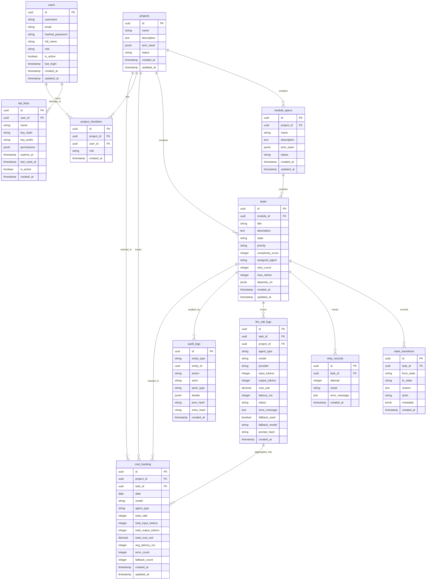

---

## 2. User Request Flow

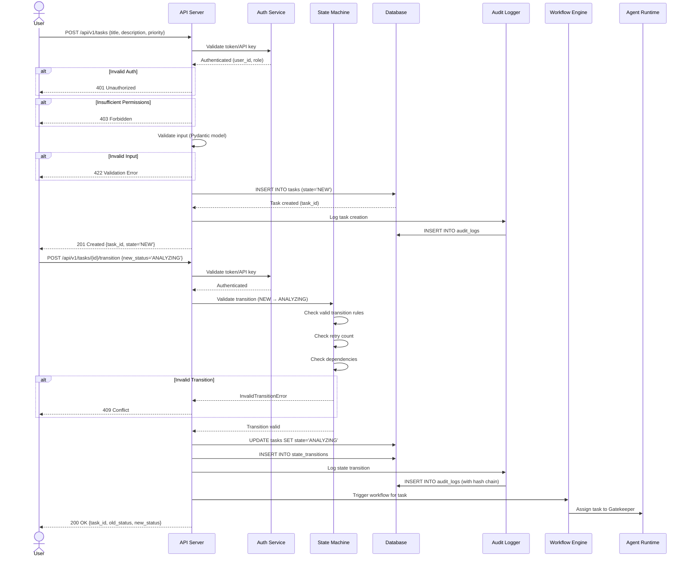

---

## 3. Agent Coordination Flow

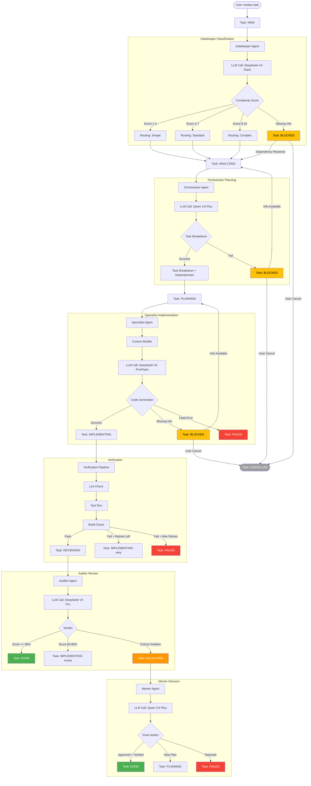

---

## 4. State Transition Flow

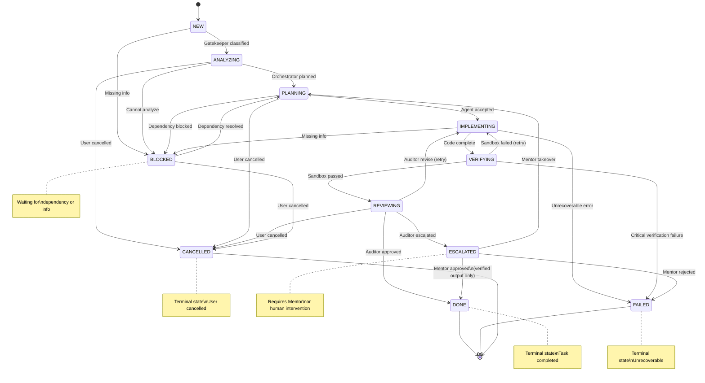

### 4.1 State Transition Data Flow

```mermaid
flowchart LR
    subgraph INPUT["Transition Input"]
        A[task_id]
        B[from_state]
        C[to_state]
        D[reason]
        E[actor]
        F[metadata]
    end

    subgraph VALIDATION["Validation Layer"]
        G[Check valid transition]
        H[Check retry count]
        I[Check dependencies]
        J[Check terminal state]
    end

    subgraph EXECUTION["Execution Layer"]
        K[Acquire row lock<br/>SELECT FOR UPDATE]
        L[Update task state]
        M[Insert state_transition]
        N[Insert audit_log<br/>with hash chain]
        O[Check cost alerts]
    end

    subgraph OUTPUT["Transition Output"]
        P[Task updated]
        Q[Transition logged]
        R[Audit trail created]
        S[Cost tracked]
        T[Event published]
    end

    INPUT --> VALIDATION
    VALIDATION -->|Valid| EXECUTION
    VALIDATION -->|Invalid| ERR[409 Conflict Error]
    EXECUTION --> OUTPUT

    style INPUT fill:#E3F2FD
    style VALIDATION fill:#FFF3E0
    style EXECUTION fill:#E8F5E9
    style OUTPUT fill:#FCE4EC
    style ERR fill:#FFCDD2
```

---

## 5. LLM Call Flow

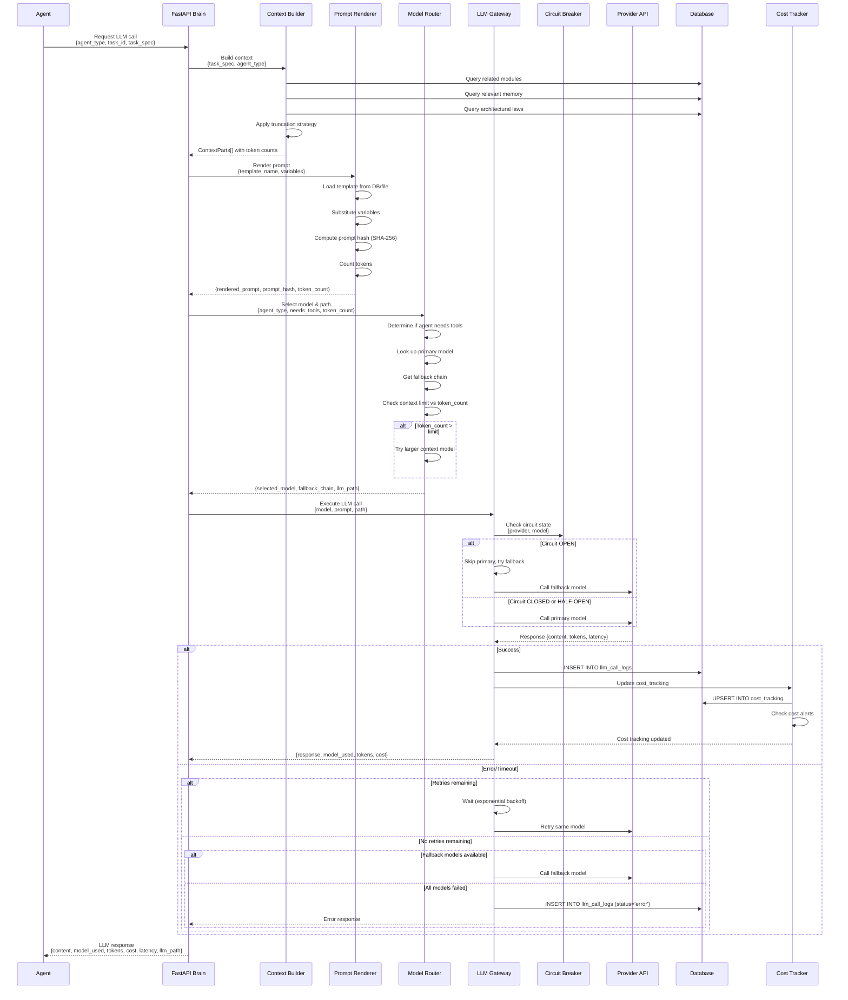

### 5.1 LLM Call Data Stores

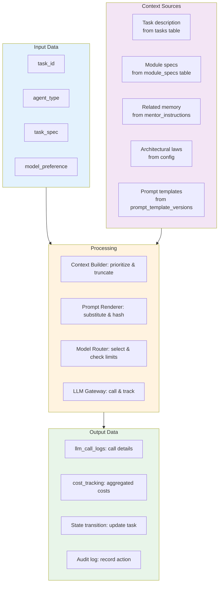

---

## 6. Verification Flow

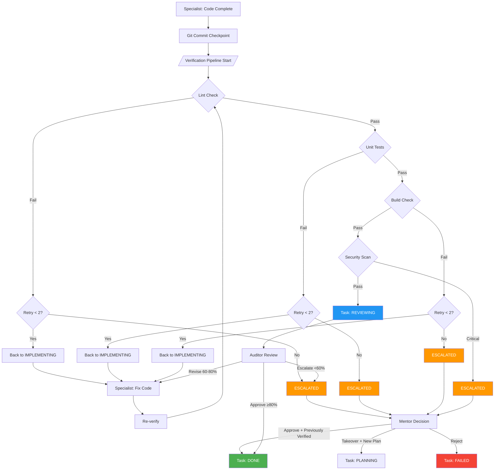

### 6.1 Verification Data Flow

```mermaid
flowchart LR
    subgraph INPUT["Verification Input"]
        A1[Task ID]
        A2[Module ID]
        A3[Code files]
        A4[Test files]
    end

    subgraph STEPS["Verification Steps"]
        B1[Step 1: Lint<br/>eslint, prettier]
        B2[Step 2: Test<br/>pytest, vitest]
        B3[Step 3: Build<br/>npm run build]
        B4[Step 4: Security<br/>npm audit]
    end

    subgraph RESULTS["Results Storage"]
        C1[state_transitions: VERIFYING → RESULT]
        C2[retry_records: attempt & result]
        C3[audit_logs: verification details]
    end

    INPUT --> STEPS
    STEPS --> RESULTS

    style INPUT fill:#E3F2FD
    style STEPS fill:#FFF3E0
    style RESULTS fill:#E8F5E9
```

---

## 7. Memory Retrieval Flow

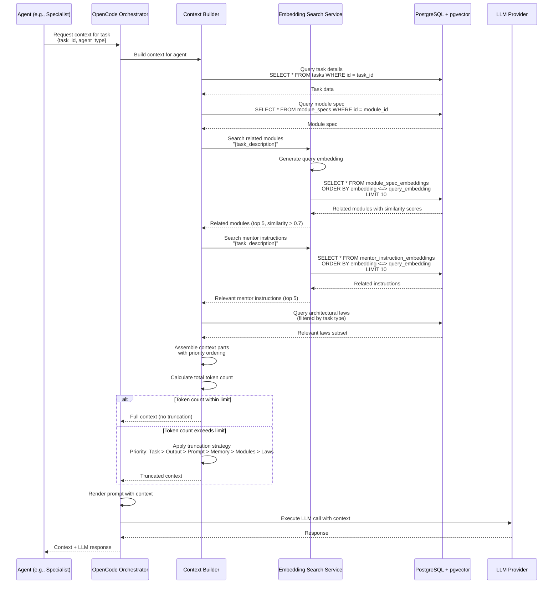

### 7.1 Memory Data Lifecycle

```mermaid
flowchart TB
    subgraph CREATE["Create"]
        A1[New task created<br/>→ task_embeddings generated]
        A2[New module spec<br/>→ module_spec_embeddings generated]
        A3[New mentor instruction<br/>→ mentor_instruction_embeddings generated]
        A4[New architecture decision<br/>→ stored in decision_history]
    end

    subgraph PROCESS["Process"]
        B1[Embedding generation<br/>→ text-embedding-3-small]
        B2[Vector storage<br/>→ pgvector tables]
        B3[Similarity search<br/>→ cosine similarity > threshold]
        B4[Context assembly<br/>→ priority-based selection]
    end

    subgraph STORE["Store"]
        C1[tasks table<br/>Task metadata]
        C2[module_specs table<br/>Module specifications]
        C3[mentor_instructions table<br/>Teaching content]
        C4[task_embeddings<br/>Task vectors]
        C5[module_spec_embeddings<br/>Module vectors]
        C6[mentor_instruction_embeddings<br/>Instruction vectors]
    end

    subgraph ARCHIVE["Archive"]
        D1[Tasks > 1 year<br/>→ cold storage]
        D2[Embeddings > 1 year<br/>→ re-evaluate relevance]
        D3[Audit logs > 3 years<br/>→ S3 Glacier]
        D4[LLM call logs > 90 days<br/>→ delete (keep cost summary)]
    end

    CREATE --> PROCESS --> STORE
    STORE --> ARCHIVE

    style CREATE fill:#E3F2FD
    style PROCESS fill:#FFF3E0
    style STORE fill:#E8F5E9
    style ARCHIVE fill:#FFCDD2
```

---

## 8. Data Lifecycle

### 8.1 Data Lifecycle Overview

```mermaid
flowchart LR
    subgraph CREATE_PHASE["CREATE"]
        A1[User input<br/>Task creation]
        A2[Agent output<br/>LLM responses]
        A3[System events<br/>State transitions]
        A4[Cost tracking<br/>LLM call logs]
    end

    subgraph PROCESS_PHASE["PROCESS"]
        B1[State machine<br/>Validate transitions]
        B2[Context builder<br/>Build LLM context]
        B3[Prompt renderer<br/>Template substitution]
        B4[Cost calculator<br/>Token → USD]
    end

    subgraph STORE_PHASE["STORE"]
        C1[PostgreSQL<br/>Primary database]
        C2[pgvector<br/>Embeddings]
        C3[Audit logs<br/>Hash chain]
        C4[Cost tracking<br/>Aggregated]
    end

    subgraph ARCHIVE_PHASE["ARCHIVE"]
        D1[Cold storage<br/>Completed tasks >1y]
        D2[S3 Glacier<br/>Audit logs >3y]
        D3[Delete<br/>LLM logs >90d]
        D4[Anonymize<br/>Inactive users]
    end

    CREATE_PHASE --> PROCESS_PHASE --> STORE_PHASE --> ARCHIVE_PHASE
```

### 8.2 Data Retention Details

| Data Type | Hot Storage | Warm Storage | Cold Storage | Delete |
|-----------|------------|-------------|-------------|--------|
| Active tasks | PostgreSQL (real-time) | — | — | — |
| Completed tasks | 1 year | — | S3 Glacier | After 3 years |
| Failed/Cancelled tasks | 90 days | — | — | After 180 days |
| State transitions | Same as task | — | Same as task | Same as task |
| **Audit logs** | **1 year** | — | **S3 Glacier** | **After 6 years** |
| **LLM call logs** | **90 days** | — | — | **After 90 days** |
| **Cost tracking** | **3 years** | — | **S3 Glacier** | **After 7 years** |
| Embeddings | While active | — | — | Re-embed on model change |
| Prompt templates | Indefinite (versioned) | — | — | Never |
| API keys | While active | — | — | 1 year after revocation |
| Revoked tokens | Until expiry | — | — | After expiry |
| Session data | 7 days | — | — | After 7 days |

### 8.3 Data Flow Between Components

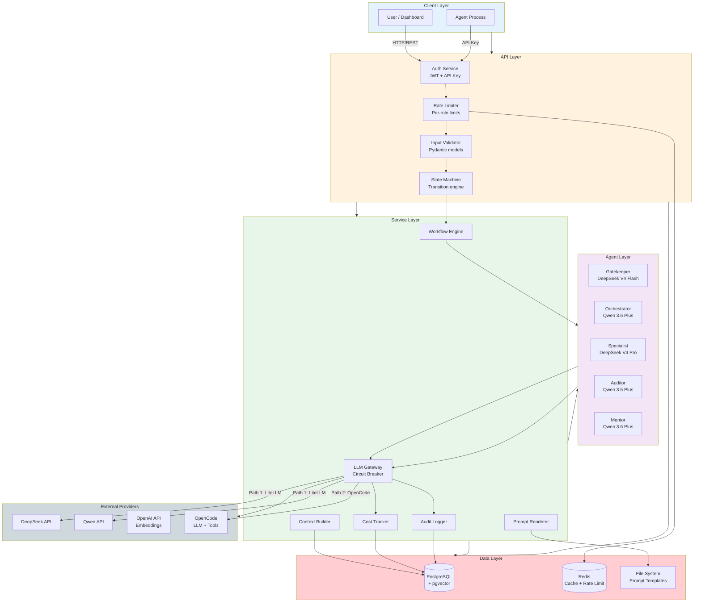

---

## 9. Integration Touchpoints

### 9.1 Component Integration Matrix

| Component | Integrates With | Protocol | Data Exchanged | Failure Mode |
|-----------|----------------|----------|----------------|-------------|
| API Server | Auth Service | Internal function call | JWT validation, API key lookup | 401 Unauthorized |
| API Server | State Machine | Internal function call | Task state transitions | 409 Conflict |
| State Machine | Database | PostgreSQL connection | Task state, audit logs | 500 Database error |
| State Machine | Audit Logger | Internal function call | Transition events | Log failure (non-blocking) |
| Workflow Engine | LLM Gateway | Internal function call | LLM requests/responses | Fallback to next model |
| LLM Gateway | DeepSeek API | HTTPS REST (via LiteLLM) | Prompts, completions, tokens | Circuit breaker → fallback |
| LLM Gateway | Qwen API | HTTPS REST (via LiteLLM) | Prompts, completions, tokens | Circuit breaker → fallback |
| LLM Gateway | OpenAI API | HTTPS REST | Embedding requests | Error + cached embedding |
| LLM Gateway | OpenCode | Process/API calls | LLM calls + tool execution | Graceful degradation to ESCALATED |
| Context Builder | PostgreSQL | SQL queries | Tasks, modules, memory | Use cached context |
| Context Builder | pgvector | Vector similarity search | Related modules, instructions | Fall back to LIKE search |
| Prompt Renderer | File System | File I/O | Prompt templates | Use DB version |
| Prompt Renderer | PostgreSQL | SQL queries | Template overrides | Use file version |
| Cost Tracker | PostgreSQL | SQL queries | LLM call logs, aggregated costs | Log error, continue |
| Rate Limiter | Redis | Redis protocol | Rate limit counters | Allow request (fail open) |

### 9.2 Data Flow Summary per Endpoint

| Endpoint | Source Data | Processing | Destination Data | External Calls |
|----------|------------|-----------|-----------------|----------------|
| `POST /login` | User credentials → Auth Service | Validate, generate JWT | tokens table (refresh) | None |
| `POST /tasks` | Task data → State Machine | Validate, set state=NEW | tasks, audit_logs | None |
| `POST /tasks/{id}/transition` | Transition request → State Machine | Validate, execute transition | tasks, state_transitions, audit_logs | None (unless triggers workflow) |
| `POST /tasks/{id}/transition` (ANALYZING) | Transition → Workflow Engine | Assign to Gatekeeper | tasks (status update) | LLM call (DeepSeek V4 Flash) |
| `POST /tasks/{id}/transition` (IMPLEMENTING→VERIFYING) | Transition → Verification Pipeline | Run lint, test, build | retry_records, audit_logs | OpenCode bash commands |
| `GET /cost-stats` | cost_tracking table | Aggregate by model/agent | Response JSON | None |
| `GET /audit-logs` | audit_logs table | Filter, paginate | Response JSON | None |
| `GET /health` | Database, Redis checks | Health checks | Response JSON | LLM provider ping |

### 9.3 Asynchronous Data Flows

```mermaid
flowchart TB
    subgraph SCHEDULED["Scheduled Jobs"]
        A1[Daily 3AM UTC<br/>Cleanup job<br/>- Delete expired tokens<br/>- Delete old LLM logs<br/>- Archive old audit logs<br/>- Anonymize inactive users]
        A2[Daily 6AM UTC<br/>Cost aggregation<br/>- Aggregate llm_call_logs<br/>- Update cost_tracking<br/>- Check cost alerts]
        A3[Weekly Monday 9AM<br/>Weekly cost report<br/>- Generate report<br/>- Send email]
        A4[Hourly<br/>Stuck task detection<br/>- Find tasks stuck >30min<br/>- Alert team]
        A5[Every 5 min<br/>Circuit breaker health<br/>- Check provider status<br/>- Update metrics]
    end

    subgraph EVENT["Event-Driven"]
        B1[State transition event<br/>→ Trigger workflow]
        B2[LLM call complete<br/>→ Update cost_tracking]
        B3[Cost threshold exceeded<br/>→ Send alert]
        B4[Task completed<br/>→ Notify user]
        B5[Circuit breaker open<br/>→ Alert + switch fallback]
    end

    A1 --> |Writes| PG[(PostgreSQL)]
    A2 --> |Reads + Writes| PG
    A3 --> |Reads| PG
    A3 --> |Sends| EMAIL[(Email)]
    A4 --> |Reads| PG
    A4 --> |Sends| SLACK[(Slack)]
    A5 --> |Reads| REDIS[(Redis)]
    A5 --> |Writes| METRICS[(Prometheus)]

    B1 --> |Triggers| WF[(Workflow Engine)]
    B2 --> |Writes| PG
    B3 --> |Sends| SLACK
    B4 --> |Sends| EMAIL
    B5 --> |Writes| METRICS

    style SCHEDULED fill:#E3F2FD
    style EVENT fill:#FFF3E0
    style PG fill:#E8F5E9
    style REDIS fill:#FFCDD2
    style METRICS fill:#F3E5F5
    style EMAIL fill:#CFD8DC
    style SLACK fill:#CFD8DC
```

---

*Tài liệu version: 1.0.0*
*Last updated: 2026-05-14*
*Maintained by: AI SDLC System Architecture Team*