# OpenCode Integration — LLM + Tool Provider cho AI SDLC System

## Metadata

- **Version**: 3.0.0
- **Created**: 2026-05-14
- **Last Updated**: 2026-05-15
- **Related**: [ARCHITECTURE.md](../ARCHITECTURE.md), [state-machine.md](./state-machine.md), [agent-matrix.md](./agent-matrix.md)
- **Key Change from v2**: OpenCode no longer the brain — FastAPI backend handles all orchestration. OpenCode provides LLM access and tool execution.

---

## 1. OpenCode — LLM + Tool Provider

OpenCode đóng vai trò **provider** cho AI SDLC System — cung cấp 2 khả năng chính:

1. **LLM Access**: Truy cập các model LLM (DeepSeek, Qwen) đã được cấu hình sẵn trong OpenCode
2. **Tool Execution**: Cung cấp các tools thao tác filesystem và shell (bash, edit, write, read, glob, grep)

OpenCode **KHÔNG** phải là bộ não của hệ thống. FastAPI backend mới là bộ não — orchestrate toàn bộ workflow, state machine, agent dispatch, cost tracking, audit logging.

### Tại sao OpenCode là Provider?

| Khía cạnh | FastAPI (Brain) | OpenCode (Provider) |
|---|---|---|
| **Orchestration** | Điều phối workflow, dispatch agents | — |
| **State management** | Quản lý state machine, transitions | — |
| **Agent dispatch** | Router chọn agent, gọi LLM | — |
| **LLM calls** | Gửi request qua LLM Gateway | **Nhận request → gọi model → trả response** |
| **Tool execution** | Quyết định tool nào cho agent nào | **Thực thi tool (bash, edit, write, read)** |
| **Cost tracking** | Log mọi LLM call, tính cost | — |
| **Audit logging** | Log mọi action vào DB | — |
| **Circuit breaker** | Protect LLM calls | — |

### Kiến trúc tổng quan

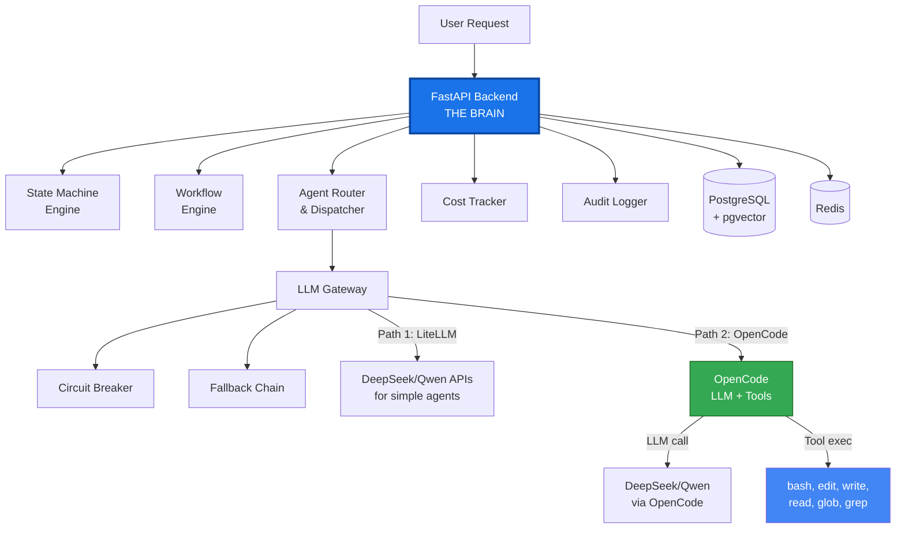

---

## 2. FastAPI Gọi OpenCode Như Thế Nào

FastAPI gọi OpenCode thông qua **2 paths** trong LLM Gateway:

### Path 1: LiteLLM trực tiếp (cho agents không cần tools)

Dùng cho: Gatekeeper, Orchestrator, Mentor, Monitoring

```
FastAPI → LLM Gateway → LiteLLM → Provider API (DeepSeek/Qwen)
```

Các agents này chỉ cần LLM để phân tích, phân loại, planning — không cần truy cập filesystem hay chạy commands.

### Path 2: OpenCode integration (cho agents cần tools)

Dùng cho: Specialist, Auditor, DevOps

```
FastAPI → LLM Gateway → OpenCode → {LLM call + Tool execution}
```

Các agents này cần:
- **Specialist**: bash (run tests), edit/write (create/modify code), read/glob/grep (find files)
- **Auditor**: read/glob/grep (review code), bash (run tests only)
- **DevOps**: bash (build/deploy), read (check configs)

### Cơ chế gọi OpenCode

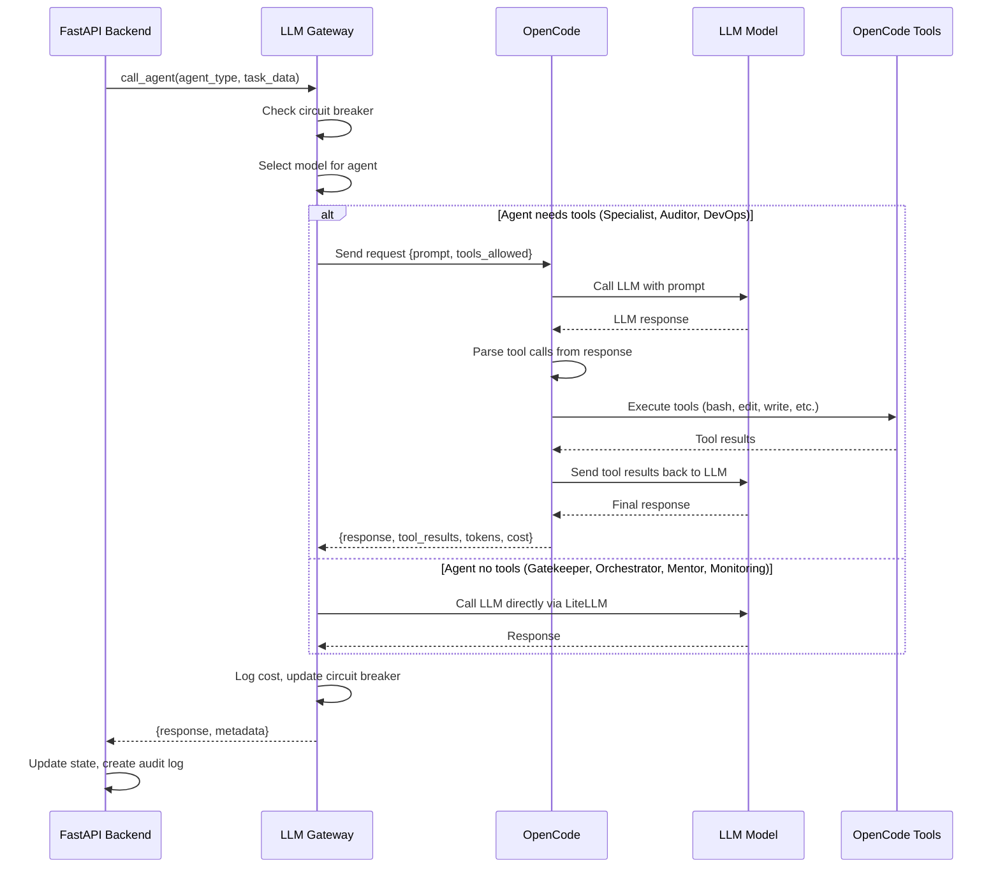

### Pseudocode gọi OpenCode

```python
# FastAPI LLM Gateway
async def call_agent_via_opencode(agent_name: str, task_data: dict) -> dict:
    # 1. Load prompt template
    prompt_template = load_prompt(f"agents/prompts/{agent_name}.txt")

    # 2. Build context (FastAPI responsibility)
    context = await build_context(agent_name, task_data)

    # 3. Inject context into template
    filled_prompt = inject_context(prompt_template, context)

    # 4. Select model based on agent
    model = get_model_for_agent(agent_name)

    # 5. Get allowed tools for this agent
    allowed_tools = get_allowed_tools(agent_name)

    # 6. Call OpenCode with prompt + tools
    response = await opencode_call(
        prompt=filled_prompt,
        model=model,
        tools=allowed_tools,
        max_tokens=get_output_budget(agent_name),
        timeout=get_timeout(agent_name),
    )

    # 7. Parse response and log
    parsed = parse_agent_response(agent_name, response)
    await log_llm_call(task_data["task_id"], agent_name, model, response)
    await create_audit_log(agent_name, parsed)

    return parsed
```

---

## 3. Tool Delegation — Dev Mode

Trong **Dev mode**, FastAPI yêu cầu OpenCode thực thi tools thay cho agents. Đây là cách hệ thống duy trì tốc độ phát triển nhanh mà không cần Docker overhead.

### 6 Tools từ OpenCode

| Tool | Mục đích | Ví dụ sử dụng | Agent nào dùng |
|---|---|---|---|
| **bash** | Chạy lệnh shell (lint, test, build, install) | `pytest tests/`, `npm run lint` | Specialist, DevOps |
| **edit** | Sửa file hiện tại (thay thế chuỗi) | Sửa bug trong code, cập nhật import | Specialist |
| **write** | Tạo file mới | Tạo module mới, test file mới | Specialist |
| **read** | Đọc nội dung file | Đọc spec, kiểm tra output | Specialist, Auditor, DevOps |
| **glob** | Tìm file theo pattern | `**/*.py`, `src/**/*.ts` | Specialist |
| **grep** | Tìm nội dung trong file | Tìm class name, function definition | Specialist, Auditor |

### Tool Delegation Flow

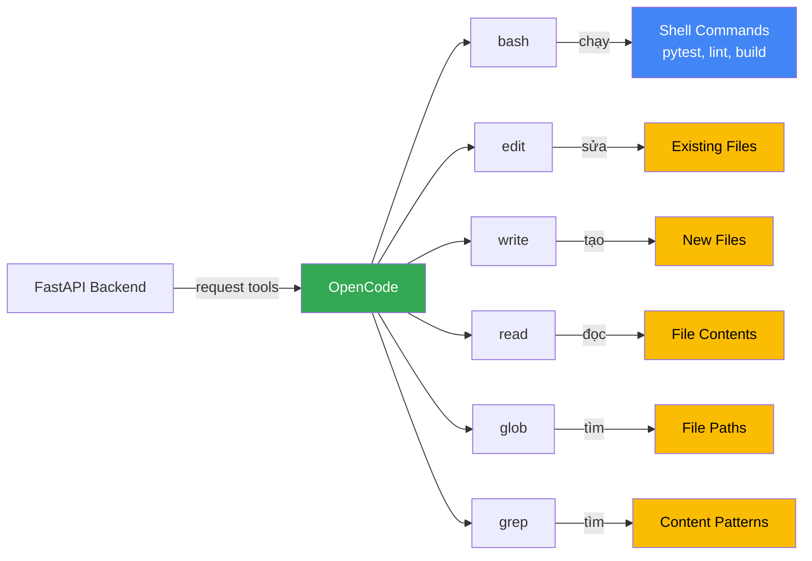

### Sandbox Verification trong Dev Mode

Dù chạy Dev mode, verification vẫn được thực hiện qua OpenCode tools:

```python
async def verify_in_dev_mode(task_id: str) -> VerificationResult:
    # FastAPI yêu cầu OpenCode chạy verification
    lint_result = await opencode_bash(f"ruff check {project_path}/")

    test_result = await opencode_bash(f"pytest {project_path}/tests/ -v")

    build_result = await opencode_bash(f"cd {project_path} && python -m build")

    security_result = await opencode_bash(f"bandit -r {project_path}/src/")

    return VerificationResult(
        lint_passed=lint_result.exit_code == 0,
        tests_passed=test_result.exit_code == 0,
        build_passed=build_result.exit_code == 0,
        security_passed=security_result.exit_code == 0,
    )
```

### An toàn trong Dev Mode

| Rủi ro | Biện pháp bảo vệ |
|---|---|
| Lệnh nguy hiểm (rm -rf) | Whitelist commands, block destructive patterns |
| Truy cập file ngoài scope | Chroot / workspace boundary |
| Lệnh mạng | Block network access trong Dev mode verification |
| Ghi file hệ thống | Chỉ cho phép write trong project directory |

---

## 4. Docker Sandbox — Production Mode

Trong **Production mode**, FastAPI giao execution cho Docker container hoàn toàn isolated. Không có direct file system access — tất cả qua container.

### Kiến trúc Docker Sandbox

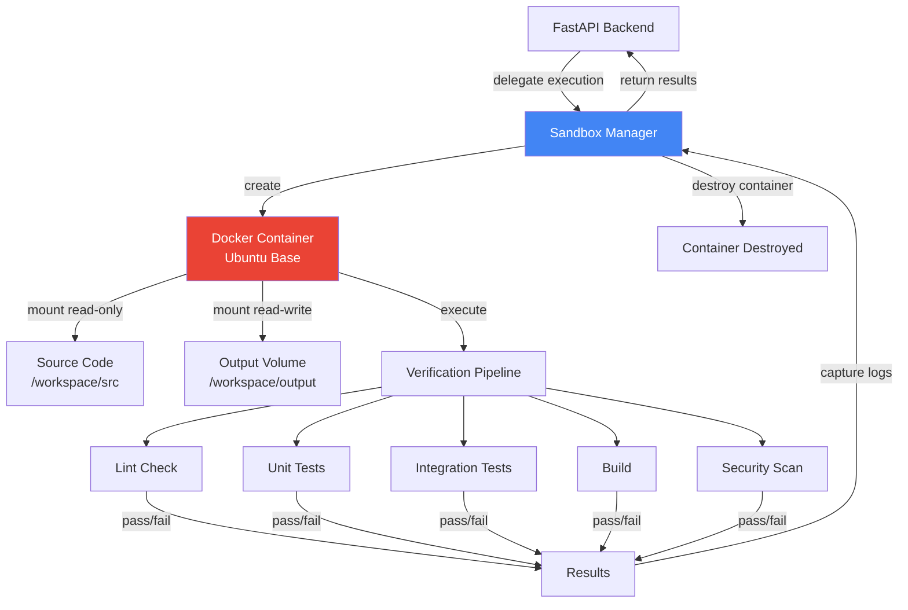

### Sandbox Lifecycle

```python
async def execute_in_sandbox(task, timeout=600):
    # FastAPI tạo và quản lý sandbox
    container = docker_client.containers.run(
        image="ai-sdlc-sandbox:latest",
        detach=True,
        volumes={
            task.source_path: {"bind": "/workspace/src", "mode": "ro"},
            task.output_path: {"bind": "/workspace/output", "mode": "rw"},
        },
        mem_limit="2g",
        cpu_period=100000,
        cpu_quota=50000,  # 50% CPU
        network_mode="none",
        timeout=timeout,
    )

    # Run verification pipeline
    exit_code = container.wait(timeout=timeout)
    logs = container.logs()

    # Capture results
    results = capture_verification_results(container, task.output_path)

    # Destroy container (always)
    container.remove(force=True)

    # Return results to FastAPI
    return results
```

### So sánh Dev Mode vs Prod Mode

| Khía cạnh | Dev Mode (OpenCode Tools) | Prod Mode (Docker Sandbox) |
|---|---|---|
| **Isolation** | Thấp — chạy trên host | Cao — isolated container |
| **Speed** | Nhanh — không có overhead | Chậm hơn — container startup |
| **Safety** | Trust code — phù hợp dev | Verify code — phù hợp deploy |
| **Tools** | bash, edit, write, read, glob, grep | Docker API, container exec |
| **Network** | Có (dev cần install packages) | Không (network_mode=none) |
| **Resource limit** | Không | CPU 50%, RAM 2GB |
| **File access** | Direct filesystem | Mount volumes (ro source, rw output) |
| **Auto-destroy** | Không — files giữ trên host | Có — container destroy sau execution |
| **Use case** | Development, prototyping, fast iteration | Production deploy, untrusted code |

### Mode Selection Logic

```python
def select_execution_mode(task) -> str:
    # FastAPI quyết định mode dựa trên risk level
    risk_mode_map = {
        "LOW": "dev",
        "MEDIUM": "dev",
        "HIGH": "prod",
        "CRITICAL": "prod",
    }

    # Manual override từ user
    if task.mode_override:
        return task.mode_override

    # Auto dựa trên risk
    return risk_mode_map.get(task.risk_level, "dev")
```

---

## 5. Integration Architecture — FastAPI → OpenCode → Agents → Execution

Kiến trúc tích hợp diễn ra theo 5 layers, với FastAPI là brain điều phối tất cả.

### Full Integration Diagram

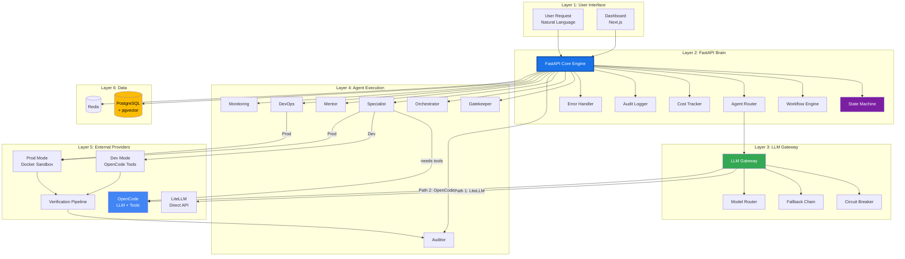

### Data Flow Chi Tiết

```
1. User → FastAPI:          Natural language request + optional mode override
2. FastAPI → Gatekeeper:     Inject prompt + memory results → LiteLLM call
3. Gatekeeper → FastAPI:     Classification result (intent, complexity, routing)
4. FastAPI → State Machine:  Update task status → ANALYZING
5. FastAPI → Orchestrator:   Inject prompt + project state → LiteLLM call
6. Orchestrator → FastAPI:   Task breakdown + dependency graph + agent assignments
7. FastAPI → State Machine:  Update task status → PLANNING
8. FastAPI → Specialist:     Inject prompt + task spec → OpenCode call (LLM + tools)
9. Specialist → FastAPI:     Code files + test files + documentation
10. FastAPI → Verification:  Run lint/test/build via OpenCode bash tool
11. FastAPI → State Machine: Update task status → VERIFYING
12. FastAPI → Auditor:       Inject prompt + code + spec → LiteLLM call
13. Auditor → FastAPI:       Verdict (APPROVED/REVISE/ESCALATE) + scores + violations
14. FastAPI → State Machine: Update task status → REVIEWING/DONE/IMPLEMENTING
15. FastAPI → Memory:        Store lesson learned in PostgreSQL
```

---

## 6. Cách Mỗi Agent Prompt Được Load và Sử Dụng

### Prompt Management Architecture

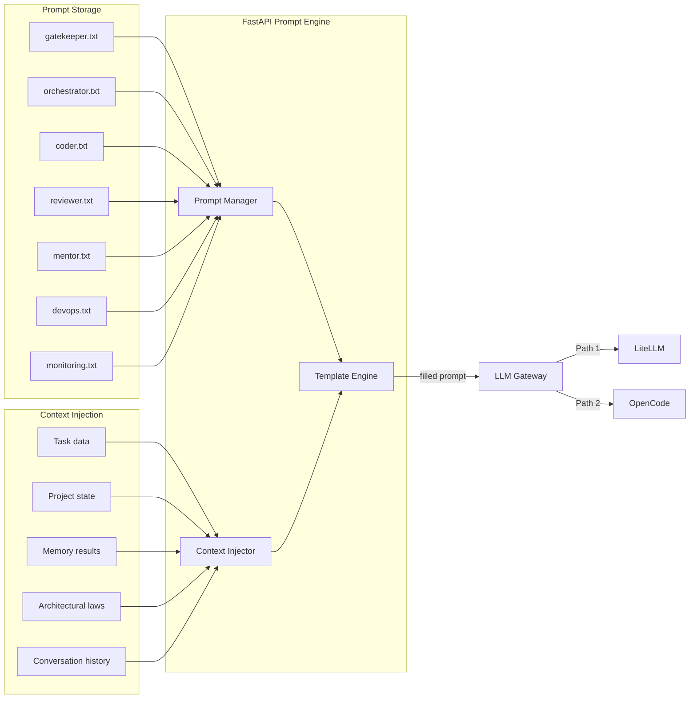

### Quy trình load và fill prompt (FastAPI)

```python
async def build_agent_prompt(agent_name: str, task_data: dict) -> str:
    # FastAPI load base prompt template
    template = Path(f"agents/prompts/{agent_name}.txt").read_text()

    # FastAPI thu thập context cần thiết cho agent
    context = await gather_context(agent_name, task_data)

    # FastAPI map context variables vào template placeholders
    filled = template.format(
        user_request=context.get("user_request", ""),
        memory_results=context.get("memory_results", ""),
        classified_task=context.get("classified_task", ""),
        project_state=context.get("project_state", ""),
        task_spec=context.get("task_spec", ""),
        code=context.get("code", ""),
        spec=context.get("spec", ""),
        test_results=context.get("test_results", ""),
        laws=context.get("laws", ""),
        task_history=context.get("task_history", ""),
        conflict_details=context.get("conflict_details", ""),
        verified_code=context.get("verified_code", ""),
        deployment_config=context.get("deployment_config", ""),
        environment_variables=context.get("environment_variables", ""),
        logs=context.get("logs", ""),
        metrics=context.get("metrics", ""),
        user_feedback=context.get("user_feedback", ""),
        historical_data=context.get("historical_data", ""),
        architectural_laws=context.get("architectural_laws", ""),
    )

    return filled
```

### Context cần thiết cho mỗi Agent

| Agent | Context Variables | Nguồn |
|---|---|---|
| **Gatekeeper** | `user_request`, `memory_results` | User input, pgvector |
| **Orchestrator** | `classified_task`, `project_state`, `memory_results` | Gatekeeper output, DB, pgvector |
| **Specialist** | `task_spec`, `context`, `architectural_laws` | Orchestrator output, DB, laws.yaml |
| **Auditor** | `code`, `spec`, `test_results`, `laws` | Specialist output, DB, laws.yaml |
| **Mentor** | `task_history`, `conflict_details`, `memory` | DB logs, pgvector |
| **DevOps** | `verified_code`, `deployment_config`, `environment_variables` | Auditor output, config |
| **Monitoring** | `logs`, `metrics`, `user_feedback`, `historical_data` | Prometheus, Loki, DB |

### System Prompt Wrapping

Mỗi agent prompt được wrap trong system prompt banner trước khi gửi đến LLM:

```
[SYSTEM]
You are a sub-agent of the AI SDLC System.
Current task: {task_id} - {task_title}
Current state: {task_state}
Project: {project_name}
Agent: {agent_name}
Model: {model_name}
[/SYSTEM]

{filled_agent_prompt}

[CONSTRAINTS]
- Tuân thủ architectural laws
- Chỉ làm đúng scope
- Output theo format quy định
- Ghi audit log cho mọi action
[/CONSTRAINTS]
```

---

## 7. Context Window Management — FastAPI Xây Dựng Context Thế Nào

Context window là tài nguyên giới hạn. FastAPI phải quản lý context hiệu quả để tránh vượt giới hạn token của model, đồng thời cung cấp đủ thông tin cho agent đưa ra quyết định đúng.

### Token Budget theo Agent

| Agent | Model | Max Tokens | Context Budget | Output Budget | Lý do |
|---|---|---|---|---|---|
| **Gatekeeper** | DeepSeek V4 Flash | 4096 | 3000 | 1000 | Input ngắn, output classification JSON |
| **Orchestrator** | Qwen 3.6 Plus | 16384 | 10000 | 6000 | Cần project state + breakdown phức tạp |
| **Specialist** | DeepSeek V4 Pro | 8192 | 4000 | 4000 | Cần code + tests, output dài |
| **Auditor** | Qwen 3.5 Plus | 8192 | 5000 | 3000 | Cần đọc code + spec để review |
| **Mentor** | Qwen 3.6 Plus | 16384 | 10000 | 6000 | Cần full history + strategic reasoning |
| **DevOps** | DeepSeek V4 Pro | 8192 | 3000 | 5000 | Input ngắn, output logs dài |
| **Monitoring** | DeepSeek V4 Flash | 4096 | 2000 | 2000 | Input metrics, output reports |

### Context Priority Ranking

```python
CONTEXT_PRIORITIES = {
    "gatekeeper": [
        ("user_request", 1.0),         # Bắt buộc
        ("memory_results", 0.8),       # Quan trọng nhưng có thể truncate
        ("task_history", 0.3),          # Ít cần
    ],
    "orchestrator": [
        ("classified_task", 1.0),      # Bắt buộc
        ("project_state", 0.9),        # Rất quan trọng
        ("memory_results", 0.7),       # Useful but secondary
        ("conversation_history", 0.4),  # Ít cần
    ],
    "specialist": [
        ("task_spec", 1.0),            # Bắt buộc — core input
        ("architectural_laws", 0.9),   # Bắt buộc — compliance
        ("related_modules", 0.7),      # Quan trọng — context
        ("memory_warnings", 0.6),      # Useful — tránh lỗi cũ
        ("conversation_history", 0.2), # Ít cần
    ],
    "auditor": [
        ("code", 1.0),                # Bắt buộc — object to review
        ("spec", 1.0),                # Bắt buộc — reference
        ("architectural_laws", 0.9),   # Bắt buộc — compliance check
        ("test_results", 0.8),        # Quan trọng
        ("task_spec", 0.3),            # Secondary
    ],
    "mentor": [
        ("task_history", 1.0),         # Bắt buộc — full context
        ("conflict_details", 1.0),    # Bắt buộc — what to resolve
        ("memory_decisions", 0.9),    # Rất quan trọng — past precedent
        ("architectural_laws", 0.7),  # Useful
    ],
}
```

---

## 8. The Flow — End-to-End

### Complete Workflow Flow

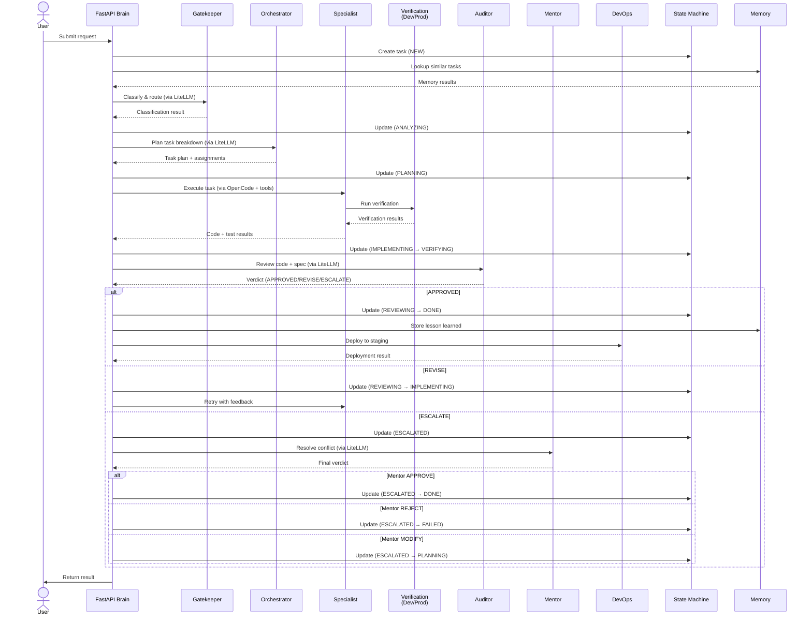

### State Transitions với Actors

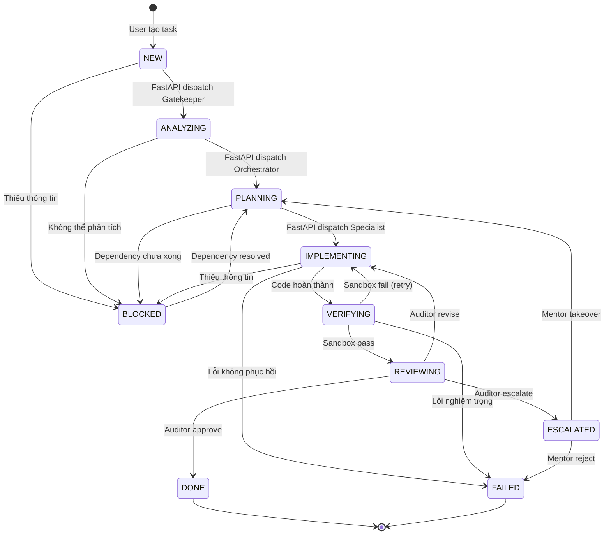

### Retry Flow

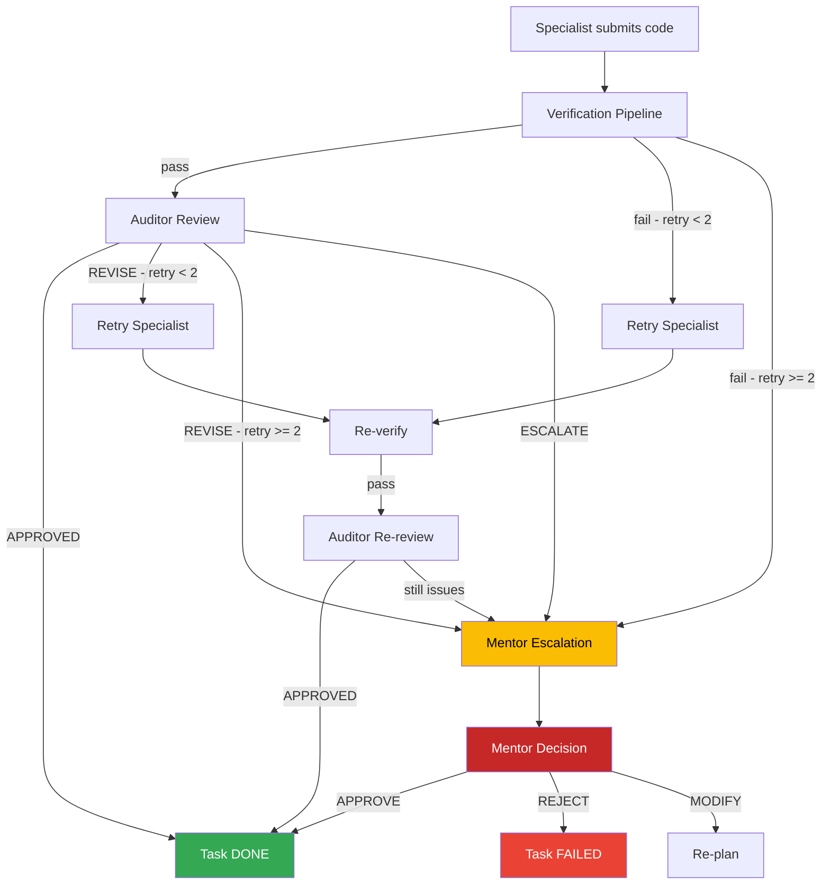

---

## 9. Agent Failures, Retries, và Escalation

### Failure Scenarios và Handling

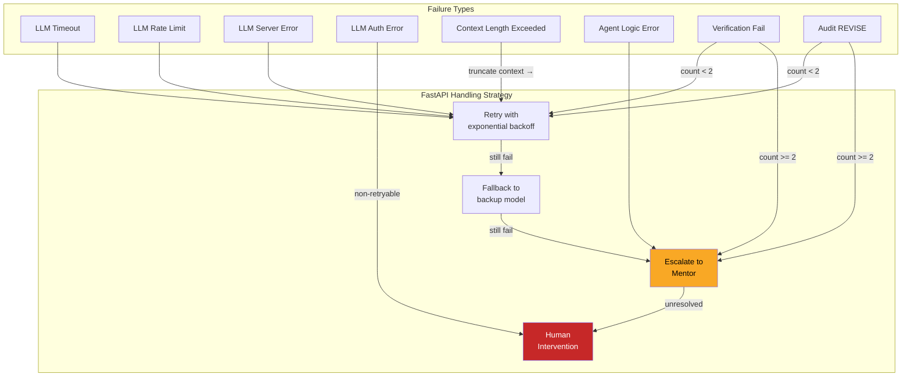

### Retry Policy

```yaml
retry_policy:
  max_retries: 2                    # LAW-010: Max 2 retries per task
  backoff_multiplier: 2
  initial_delay_seconds: 1

  per_agent_retry:
    gatekeeper:
      max_retries: 2
      fallback_model: deepseek_v4_pro
    orchestrator:
      max_retries: 2
      fallback_model: qwen_3_5_plus
    specialist:
      max_retries: 2
      fallback_model: qwen_3_5_plus
    auditor:
      max_retries: 2
      fallback_model: qwen_3_6_plus
    mentor:
      max_retries: 1                 # Mentor chỉ retry 1 lần
      fallback_model: null            # Không có fallback — strongest model
    devops:
      max_retries: 2
      fallback_model: deepseek_v4_flash
    monitoring:
      max_retries: 3                 # Monitoring cần nhiều retry hơn (continuous)
      fallback_model: qwen_3_5_plus
```

### Circuit Breaker cho LLM Calls

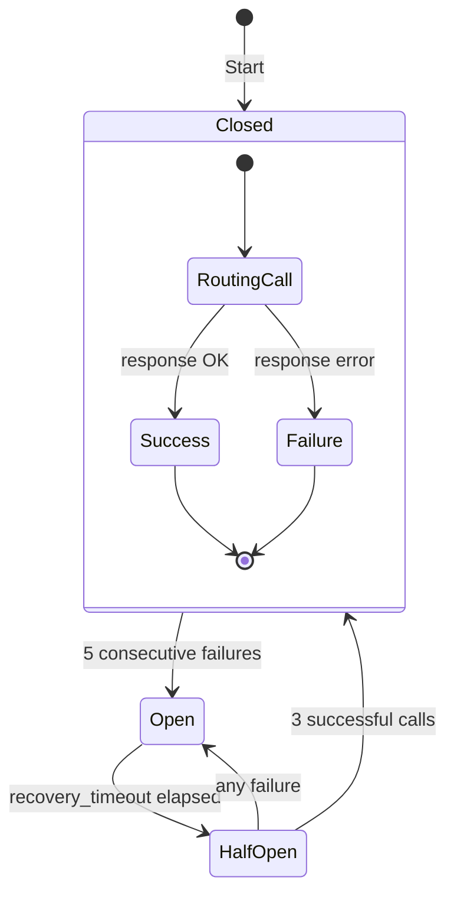

```python
# FastAPI Circuit Breaker
class CircuitBreaker:
    def __init__(self, model_config):
        self.failure_threshold = model_config.circuit_breaker.failure_threshold
        self.recovery_timeout = model_config.circuit_breaker.recovery_timeout_seconds
        self.half_open_max_calls = model_config.circuit_breaker.half_open_max_calls
        self.state = "closed"
        self.failure_count = 0
        self.last_failure_time = None
        self.half_open_success_count = 0

    async def call(self, prompt, model):
        if self.state == "open":
            if time.time() - self.last_failure_time > self.recovery_timeout:
                self.state = "half_open"
            else:
                raise CircuitBreakerOpenError(f"Circuit open for {model}")

        try:
            response = await llm_call(model, prompt)
            self.failure_count = 0
            if self.state == "half_open":
                self.half_open_success_count += 1
                if self.half_open_success_count >= self.half_open_max_calls:
                    self.state = "closed"
            return response
        except Exception as e:
            self.failure_count += 1
            self.last_failure_time = time.time()
            if self.failure_count >= self.failure_threshold:
                self.state = "open"
            raise e
```

### Escalation Logic

```python
# FastAPI handles agent failure
async def handle_agent_failure(task_id: str, agent: str, error, retry_count: int):
    # LAW-010: Max 2 retries per task
    if retry_count >= 2:
        # Escalate to Mentor
        await escalate_to_mentor(
            task_id=task_id,
            reason=f"Agent {agent} failed after {retry_count} retries: {error}",
            task_history=await get_task_history(task_id),
            conflict_details={
                "agent": agent,
                "error": str(error),
                "retry_count": retry_count,
            }
        )
        await update_task_state(task_id, "ESCALATED", actor=agent)
        return

    # Try fallback model first
    fallback = get_fallback_model(agent)
    if fallback and can_use_fallback(agent):
        await call_sub_agent(agent, task_data, model_override=fallback)
        return

    # Retry with exponential backoff
    delay = INITIAL_DELAY * (BACKOFF_MULTIPLIER ** retry_count)
    await asyncio.sleep(delay)

    # Retry same agent
    await call_sub_agent(agent, task_data)
```

### Mentor Quota Management

Per LAW-017, Mentor có giới hạn 10 calls/ngày:

```python
async def call_mentor(task_id: str, reason: str, data: dict):
    # Check quota
    quota = await get_mentor_quota(today)
    if quota.remaining <= 0:
        raise MentorQuotaExceededError(
            f"Mentor quota exceeded ({quota.max_calls}/{quota.used} today)"
        )

    # Increment quota
    await increment_mentor_quota()

    # Call Mentor via LiteLLM
    result = await call_sub_agent("mentor", data)

    # Store lesson learned
    if result.get("lesson_learned"):
        await store_lesson_learned(result["lesson_learned"])

    return result
```

---

## 10. Conversation History và Task State Management

### Task State là "Bộ Nhớ Ngoài" Của Hệ thống

AI agents không nhớ bằng cảm giác — mọi trạng thái được lưu vào database. Đó là lý do tại sao State Machine và conversation history là cốt lõi.

### Conversation History Architecture

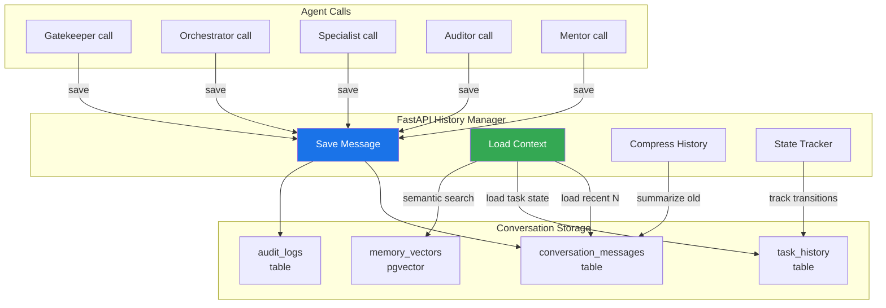

### Task State Management (FastAPI)

```python
async def update_task_state(
    task_id: str,
    new_state: str,
    actor: str,
    reason: str = "",
):
    # FastAPI validate transition (LAW-015: terminal states immutable)
    current = await get_task_state(task_id)

    if not is_valid_transition(current, new_state):
        raise InvalidTransitionError(
            f"Invalid transition: {current} → {new_state}"
        )

    if current in TERMINAL_STATES:
        raise ImmutableStateError(
            f"Cannot transition from terminal state: {current}"
        )

    # FastAPI update task state
    await db.execute(
        """
        UPDATE tasks SET status = $1, updated_at = NOW() WHERE id = $2
        """,
        new_state, task_id,
    )

    # FastAPI create history entry (LAW-012: all state changes audited)
    await db.execute(
        """
        INSERT INTO task_history
        (task_id, from_state, to_state, actor, reason)
        VALUES ($1, $2, $3, $4, $5)
        """,
        task_id, current, new_state, actor, reason,
    )

    # FastAPI create audit log (LAW-012)
    await db.execute(
        """
        INSERT INTO audit_logs
        (task_id, agent_name, action, details, severity)
        VALUES ($1, $2, 'state_transition', $3, 'info')
        """,
        task_id, actor,
        json.dumps({"from": current, "to": new_state, "reason": reason}),
    )
```

---

## 11. Sub-Agent Isolation — Mỗi Agent Chạy trong Isolated Context

### Tại sao cần Isolation?

1. **Không cross-contamination**: Agent A không thấy internal state của Agent B
2. **Token budget riêng**: Mỗi agent có budget riêng, không ảnh hưởng lẫn nhau
3. **Model riêng**: Mỗi agent dùng model phù hợp cho task
4. **Error isolation**: Lỗi của agent A không crash agent B
5. **Audit trail riêng**: Mỗi action được log riêng, dễ debug

### Isolation Architecture

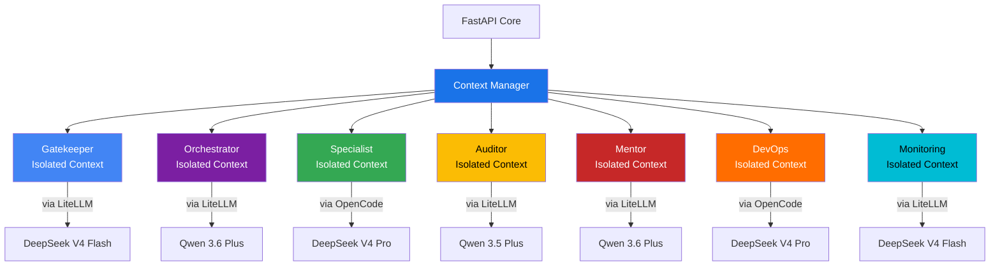

### Data Access Matrix — Agent nào được thấy gì

| Data | Gatekeeper | Orchestrator | Specialist | Auditor | Mentor | DevOps | Monitoring |
|---|---|---|---|---|---|---|---|
| User request | ✅ | ❌ | ❌ | ❌ | ❌ | ❌ | ❌ |
| Classification | — | ✅ | ❌ | ❌ | ❌ | ❌ | ❌ |
| Memory results | ✅ | ✅ | ✅ | ✅ | ✅ | ❌ | ✅ |
| Project state | ❌ | ✅ | ❌ | ❌ | ❌ | ❌ | ❌ |
| Task spec | ❌ | ✅ | ✅ | ✅ | ✅ | ❌ | ❌ |
| Source code | ❌ | ❌ | ✅ | ✅ | ✅ | ❌ | ❌ |
| Test results | ❌ | ❌ | ❌ | ✅ | ✅ | ❌ | ❌ |
| Arch laws | ❌ | ❌ | ✅ | ✅ | ✅ | ❌ | ❌ |
| Task history | ❌ | ❌ | ❌ | ❌ | ✅ | ❌ | ❌ |
| Conflict details | ❌ | ❌ | ❌ | ❌ | ✅ | ❌ | ❌ |
| Deployment config | ❌ | ❌ | ❌ | ❌ | ❌ | ✅ | ❌ |
| Logs & metrics | ❌ | ❌ | ❌ | ❌ | ❌ | ❌ | ✅ |
| Verification result | ❌ | ❌ | ✅ | ✅ | ✅ | ✅ | ❌ |

---

## 12. OpenCode Tool Usage Patterns cho Mỗi Agent Type

### Pattern Overview

Mỗi agent type có một **tool usage pattern** riêng — tập tools được phép dùng và cách sử dụng chúng.

### Specialist Tool Pattern (Full Dev Tools)

```yaml
agent: Specialist
model: DeepSeek V4 Pro
tools: [bash, edit, write, read, glob, grep]
purpose: Viết code, tạo file, chạy test
pattern:
  - read: Đọc existing code, config, specs
  - grep: Tìm kiếm definitions, usages, patterns
  - glob: Tìm file theo pattern
  - write: Tạo file mới (module, test, config)
  - edit: Sửa file hiện tại (bug fix, feature)
  - bash: Chạy lint, test, build, install
```

### Specialist: Dev Mode Execution Sequence

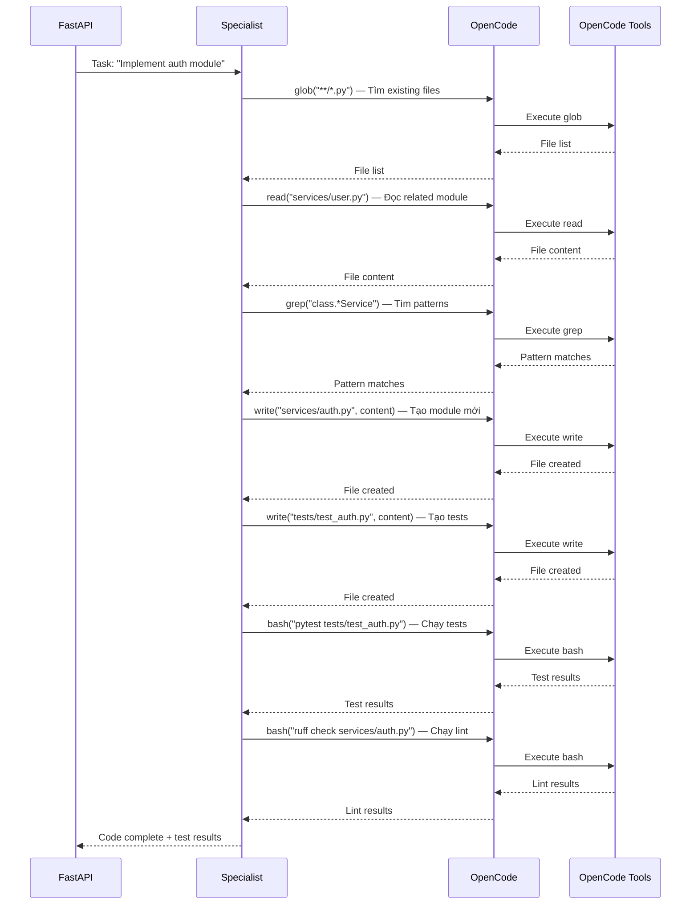

### Auditor Tool Pattern

```yaml
agent: Auditor
model: Qwen 3.5 Plus
tools: [read, grep]
purpose: Review code, check compliance
pattern:
  - read: Đọc source code, specs, test results
  - grep: Tìm kiếm violations (hardcoded secrets, business logic in controller)
```

### DevOps Tool Pattern

```yaml
agent: DevOps
model: DeepSeek V4 Pro
tools: [bash, read, glob, grep]
purpose: Build, deploy, CI/CD
pattern:
  - bash: Chạy Docker commands, kubectl, deploy scripts
  - read: Đọc config files, Dockerfile, CI/CD config
  - glob: Tìm deployment configs
  - grep: Tìm kiếm config values, environment references
```

### Tool Permission Matrix

| Tool | Gatekeeper | Orchestrator | Specialist | Auditor | Mentor | DevOps | Monitoring |
|---|---|---|---|---|---|---|---|
| **bash** | ❌ | ❌ | ✅ | ❌ | ❌ | ✅ | ❌ |
| **edit** | ❌ | ❌ | ✅ | ❌ | ❌ | ❌ | ❌ |
| **write** | ❌ | ❌ | ✅ | ❌ | ❌ | ❌ | ❌ |
| **read** | ❌ | ❌ | ✅ | ✅ | ❌ | ✅ | ❌ |
| **glob** | ❌ | ❌ | ✅ | ❌ | ❌ | ✅ | ❌ |
| **grep** | ❌ | ❌ | ✅ | ✅ | ❌ | ✅ | ❌ |

> **Logic**: Chỉ **Specialist** có quyền tạo và sửa code (write, edit). **DevOps** chỉ cần bash cho deployment. **Auditor** chỉ đọc — không bao giờ sửa code. Các agents khác (Gatekeeper, Orchestrator, Mentor, Monitoring) không cần tools — FastAPI cung cấp context qua LLM Gateway.

---

## Tóm Tắt Architecture

```mermaid
graph TB
    subgraph "FastAPI — Central Brain"
        CORE[Core Engine]
        SM[State Machine]
        WF[Workflow Engine]
        AR[Agent Router]
        CT[Cost Tracker]
        AL[Audit Logger]
        EH[Error Handler]
    end

    subgraph "LLM Gateway"
        LG[LLM Gateway]
        CB[Circuit Breaker]
        FB[Fallback Chain]
    end

    subgraph "Sub-Agents"
        GK[Gatekeeper<br/>Flash | LiteLLM]
        ORC[Orchestrator<br/>3.6 Plus | LiteLLM]
        SP[Specialist<br/>Pro | OpenCode + tools]
        AU[Auditor<br/>3.5 Plus | LiteLLM]
        MT[Mentor<br/>3.6 Plus | LiteLLM]
        DO[DevOps<br/>Pro | OpenCode + tools]
        MO[Monitoring<br/>Flash | LiteLLM]
    end

    subgraph "External Providers"
        OC[OpenCode<br/>LLM + Tools]
        LLM[LiteLLM<br/>Direct API]
        DOCKER[Docker Sandbox]
    end

    subgraph "Data"
        PG[(PostgreSQL)]
        RD[(Redis)]
    end

    CORE --> SM
    CORE --> WF
    CORE --> AR
    CORE --> CT
    CORE --> AL
    CORE --> EH

    AR --> LG
    LG --> CB
    LG --> FB

    LG -->|Path 1| LLM
    LG -->|Path 2| OC

    CORE --> GK
    CORE --> ORC
    CORE --> SP
    CORE --> AU
    CORE --> MT
    CORE --> DO
    CORE --> MO

    SP --> OC
    DO --> OC
    SP --> DOCKER

    CORE --> PG
    CORE --> RD

    style CORE fill:#1a73e8,color:#fff,stroke:#0d47a1,stroke-width:3px
    style LG fill:#34a853,color:#fff
    style OC fill:#4285f4,color:#fff
    style PG fill:#fbbc04,color:#000
```

---

## Metadata
- **Version**: 3.0.0
- **Created**: 2026-05-14
- **Last Updated**: 2026-05-15
- **Key Change from v2**: OpenCode is now LLM + Tool Provider, not the brain. FastAPI backend handles all orchestration.
