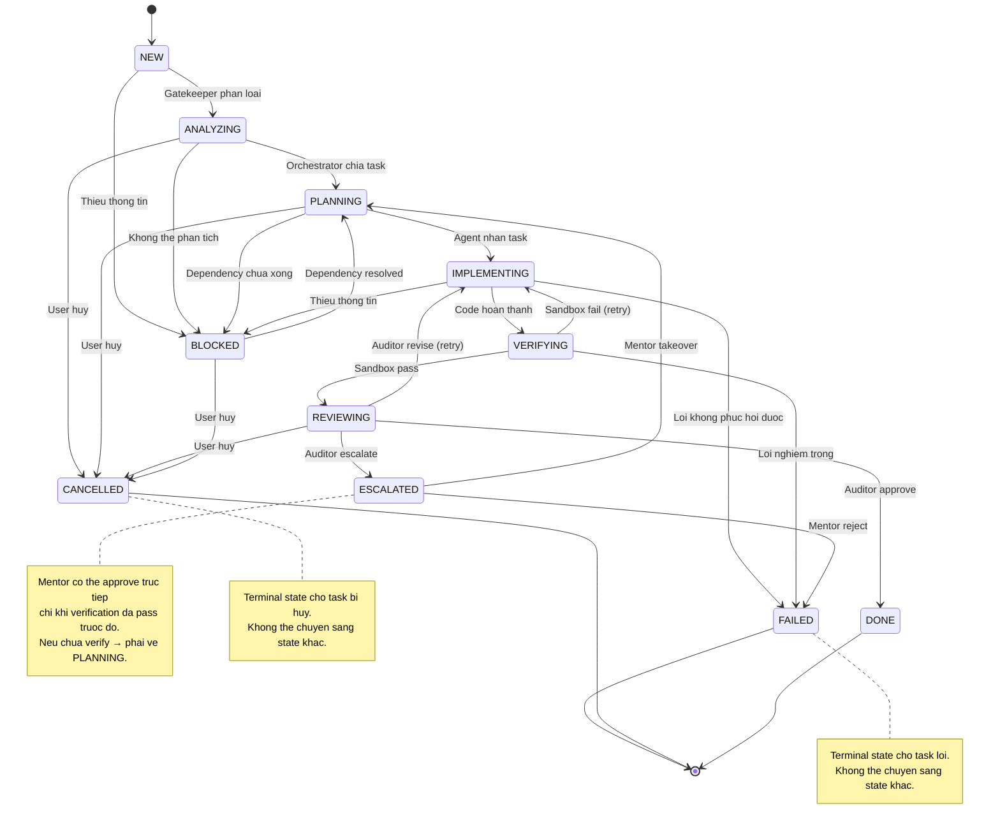

# Workflow State Machine - AI SDLC System

## Overview
Every task in the system flows through a defined state machine. This document specifies all valid states, transitions, and rules.

## State Diagram



## States Definition

| State | Description | Entry Condition | Exit Condition | Terminal |
|---|---|---|---|---|
| `NEW` | Task moi tao, chua xu ly | User tao task | Gatekeeper phan loai xong | No |
| `ANALYZING` | Dang phan tich nghiep vu | Gatekeeper nhan task | Orchestrator chia task xong | No |
| `PLANNING` | Dang lap ke hoach thuc thi | Orchestrator nhan task | Agent nhan task | No |
| `IMPLEMENTING` | Dang thuc thi code | Agent bat dau lam | Code hoan thanh | No |
| `VERIFYING` | Dang kiem tra trong sandbox | Code dua vao sandbox | Sandbox pass/fail | No |
| `REVIEWING` | Dang review boi Auditor | Sandbox pass | Auditor approve/revise | No |
| `DONE` | Task hoan thanh thanh cong | Auditor approve hoac Mentor approve (co verified output) | Khong co exit | Yes |
| `ESCALATED` | Task that bai, can Mentor | Retry > 2 hoac Auditor escalate | Mentor takeover/reject | No |
| `BLOCKED` | Task bi chan | Dependency chua xong hoac thieu thong tin | Dependency resolved | No |
| `FAILED` | Task that bai vinh vien | Loi khong phuc hoi, Mentor reject, hoac verification that bai nghiem trong | Khong co exit (terminal) | Yes |
| `CANCELLED` | Task bi huy boi user | User quyet dinh huy | Khong co exit (terminal) | Yes |

## Terminal States

Task ket thuc tai mot trong 3 states:

| Terminal State | Nghia | Dieu kien |
|---|---|---|
| `DONE` | Thanh cong | Auditor approve VA verification pass, HOAC Mentor approve voi verified output |
| `FAILED` | That bai vinh vien | Mentor reject, loi khong phuc hoi, hoac verification that bai nghiem trong |
| `CANCELLED` | Huy boi user | User quyet dinh khong lam nua |

## Valid Transitions

```yaml
valid_transitions:
  NEW:
    - target: ANALYZING
      condition: "Gatekeeper da phan loai task"
      actor: Gatekeeper
    - target: BLOCKED
      condition: "Thieu thong tin de phan tich"
      actor: Gatekeeper

  ANALYZING:
    - target: PLANNING
      condition: "Orchestrator da chia task"
      actor: Orchestrator
    - target: BLOCKED
      condition: "Khong the phan tich do thieu thong tin"
      actor: Orchestrator
    - target: CANCELLED
      condition: "User huy task"
      actor: User

  PLANNING:
    - target: IMPLEMENTING
      condition: "Agent da nhan task va context"
      actor: Specialist
    - target: BLOCKED
      condition: "Dependency chua hoan thanh"
      actor: Orchestrator
    - target: CANCELLED
      condition: "User huy task"
      actor: User

  IMPLEMENTING:
    - target: VERIFYING
      condition: "Code da hoan thanh, dua vao sandbox"
      actor: Specialist
    - target: BLOCKED
      condition: "Thieu thong tin de tiep tuc"
      actor: Specialist
    - target: FAILED
      condition: "Loi khong phuc hoi duoc (vd: dependency khong ton tai, syntax error fatal)"
      actor: System

  VERIFYING:
    - target: REVIEWING
      condition: "Sandbox pass (lint, test, build, security)"
      actor: Sandbox
    - target: IMPLEMENTING
      condition: "Sandbox fail, retry count < max_retries"
      actor: Sandbox
    - target: FAILED
      condition: "Verification that bai nghiem trong va da het retry"
      actor: System

  REVIEWING:
    - target: DONE
      condition: "Auditor approve (confidence >= threshold)"
      actor: Auditor
    - target: IMPLEMENTING
      condition: "Auditor revise (confidence < threshold)"
      actor: Auditor
    - target: ESCALATED
      condition: "Auditor escalate (critical violation)"
      actor: Auditor
    - target: CANCELLED
      condition: "User huy task"
      actor: User

  ESCALATED:
    - target: PLANNING
      condition: "Mentor takeover, tao plan moi"
      actor: Mentor
    - target: FAILED
      condition: "Mentor reject task"
      actor: Mentor

  BLOCKED:
    - target: PLANNING
      condition: "Dependency da hoan thanh"
      actor: Orchestrator
    - target: CANCELLED
      condition: "User huy task"
      actor: User

  DONE:
    # Terminal state - no valid transitions

  FAILED:
    # Terminal state - no valid transitions

  CANCELLED:
    # Terminal state - no valid transitions
```

## Escalated -> DONE Rule (LAW-009 Exception)

Mentor co the approve task truc tiep tu `ESCALATED -> DONE` CHI KHI:

1. Task da pass verification truoc do (co verification_result = PASS)
2. Mentor review va xac nhan output dung
3. Mentor ghi reason vao audit log

Neu task CHUA pass verification → Mentor phai chuyen ve `PLANNING` de lai lam tu dau.

Quy trinh:
```
ESCALATED (da verified) → DONE (Mentor approve) ✅
ESCALATED (chua verified) → PLANNING (Mentor takeover) → IMPLEMENTING → VERIFYING → REVIEWING → DONE ✅
ESCALATED → DONE (chua verify) ❌ VI PHAM LAW-009
```

## Invalid Transitions (Explicitly Blocked)

| From | To | Reason |
|---|---|---|
| `DONE` | `ANY` | Task da hoan thanh, khong duoc sua doi |
| `FAILED` | `ANY` | Task da that bai vinh vien, khong duoc chuyen |
| `CANCELLED` | `ANY` | Task da huy, khong duoc chuyen |
| `VERIFYING` | `PLANNING` | Phai qua retry/escalate, khong duoc quay lai planning |
| `REVIEWING` | `PLANNING` | Phai qua retry (IMPLEMENTING), khong duoc skip verify |
| `REVIEWING` | `VERIFYING` | Da qua verify roi, khong duoc quay lai |
| `ESCALATED` | `IMPLEMENTING` | Phai qua Mentor takeover (PLANNING) |
| `ESCALATED` | `VERIFYING` | Phai qua IMPLEMENTING truoc |
| `ESCALATED` | `REVIEWING` | Phai qua IMPLEMENTING → VERIFYING truoc |
| `BLOCKED` | `IMPLEMENTING` | Phai qua PLANNING truoc |
| `BLOCKED` | `VERIFYING` | Phai qua PLANNING va IMPLEMENTING truoc |
| `NEW` | `DONE` | Phai qua toan bo workflow |
| `ANY` | `DONE` | Chi REVIEWING → DONE duoc (hoac EXCEPTION: ESCALATED → DONE voi verified output) |

## Transition Rules

### General Rules
1. Moi transition phai tao audit log entry
2. Moi transition phai co ly do (reason)
3. Moi transition phai ghi nhan actor (agent name)
4. Khong duoc skip states (tru khi Mentor override voi ly do cu the)

### Retry Rules
1. Max retries per task: **2**
2. Retry chi duoc trigger tu VERIFYING → IMPLEMENTING hoac REVIEWING → IMPLEMENTING
3. Sau 2 retries, task phai chuyen sang ESCALATED
4. Moi retry phai ghi nhan ly do va error log

### Escalation Rules
1. Escalation trigger: retry > 2 OR critical law violation OR Mentor decision
2. Escalated tasks duoc uu tien cao nhat
3. Mentor phai respond trong thoi gian quy dinh
4. Mentor decision la final (khong duoc retry sau Mentor verdict)

### Terminal State Rules
1. `DONE`: Task hoan thanh thanh cong, khong chuyen duoc nua
2. `FAILED`: Task that bai vinh vien, khong chuyen duoc nua
   - Trigger: Mentor reject, fatal error, verification fail nghiem trong
   - Failed tasks van duoc giu lai trong DB cho audit va learning
3. `CANCELLED`: Task huy boi user, khong chuyen duoc nua
   - Trigger: User quyet dinh huy
   - Cancelled tasks van duoc giu lai trong DB cho audit

### Rollback Rules
1. Rollback chi duoc trigger boi: Mentor decision, human approval, hoac system error
2. Rollback phai ghi nhan: ly do, nguoi trigger, trang thai rollback
3. Rollback phai restore task ve trang thai truoc do
4. Rollback phai tao audit log entry
5. Rollback khong ap dung cho terminal states (DONE, FAILED, CANCELLED)

### BLOCKED State Resolution (v4.1)
Khi task bi BLOCKED va dependency duoc giai quyet:
1. Task quay ve `PLANNING` (khong phai state truoc do)
2. Ly do: BLOCKED co the lau, context da thay doi, can re-plan
3. Exception: Neu task chi bi block it thoi gian va context khong doi → cho phep quay ve state truoc do (configurable)
4. Luu reason khi transition BLOCKED → PLANNING de track context

### BLOCKED Timeout Protocol (NEW v4.1)
BLOCKED state khong con la "ho den" — co timeout va auto-escalation:

| Thoi gian | Action | Notification |
|---|---|---|
| 0 phut | Task enters BLOCKED | Dashboard notification to user |
| 60 phut | Warning sent | Slack + Dashboard (HIGH priority) |
| 120 phut | Auto-escalate to ESCALATED | Slack + Email + Dashboard (CRITICAL) |

BLOCKED state gio co 3 exits (was 2):
- `BLOCKED → PLANNING`: Dependency resolved
- `BLOCKED → CANCELLED`: User cancels
- `BLOCKED → ESCALATED`: **NEW** — Timeout auto-escalation (120+ minutes)

Khi auto-escalate:
1. Task status chuyen tu BLOCKED sang ESCALATED
2. failure_reason duoc set: "Auto-escalated: task was BLOCKED for 120+ minutes"
3. Notification gui den Mentor va team
4. Mentor nhan full context: task spec, BLOCKED reason, time stuck
5. Mentor quyet dinh: cancel task, create new plan, hoac request user input

## State Transition API

```
POST /api/v1/tasks/{task_id}/transition
Body: {
  "new_status": "ANALYZING",
  "reason": "Gatekeeper da phan loai task",
  "actor": "gatekeeper-agent"
}

Response: {
  "task_id": "uuid",
  "old_status": "NEW",
  "new_status": "ANALYZING",
  "timestamp": "2026-05-14T10:00:00Z",
  "audit_log_id": "uuid"
}

Error Response (Invalid Transition): {
  "detail": "Invalid transition: DONE -> IMPLEMENTING. Reason: Task da hoan thanh, phai qua rollback"
}
```

## Metadata

- **Version**: 4.1.0
- **Created**: 2026-05-14
- **Last Updated**: 2026-05-15
- **Changes v4.1**: Added BLOCKED timeout protocol (120min auto-escalation), BLOCKED → ESCALATED transition, human-in-the-loop notifications
- **Last Updated**: 2026-05-14
- **Total States**: 11 (9 original + FAILED + CANCELLED)
- **Valid Transitions**: 22
- **Invalid Transitions**: 22
- **Terminal States**: 3 (DONE, FAILED, CANCELLED)